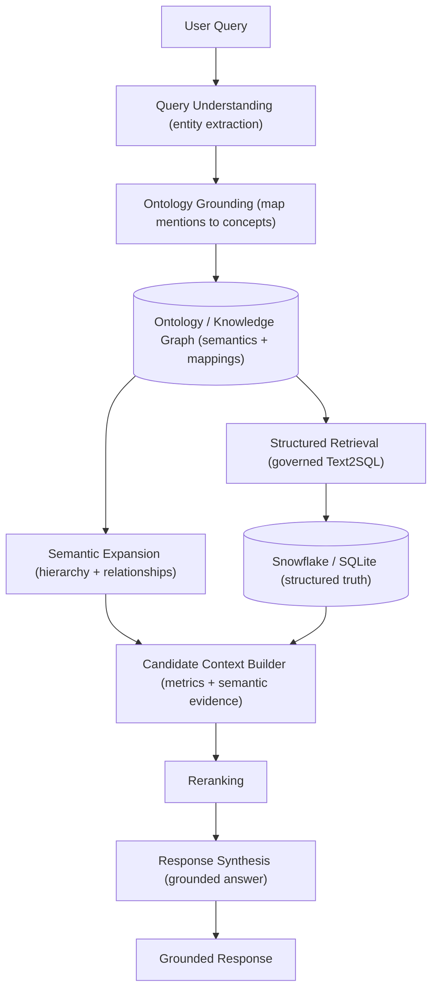
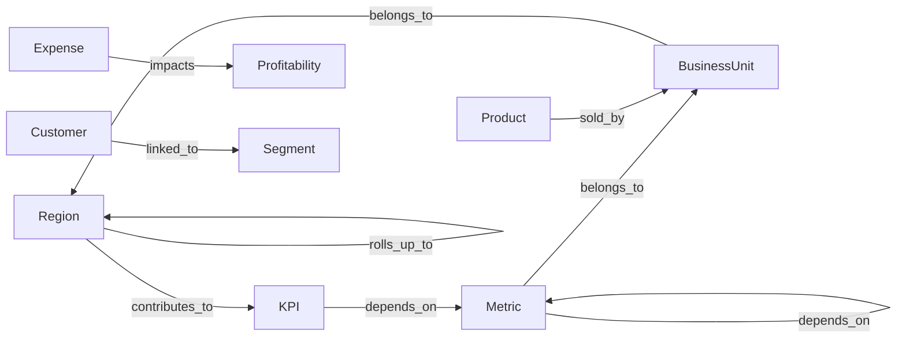

# GraphRAG Pipeline for Structured Financial Data

## Core Idea

This project demonstrates a GraphRAG pipeline for structured financial analytics data with a mapped domain ontology.

The key idea is that GraphRAG is not "put documents in a graph database." In this architecture, GraphRAG means ontology-driven, relationship-aware retrieval orchestration over enterprise data.

- Snowflake stores structured truth: facts, dimensions, transactions, KPIs, and governed tables.
- The knowledge graph stores business semantics: hierarchies, metric dependencies, ontology relationships, and mappings from business concepts to warehouse tables and columns.
- The orchestration layer grounds the user query on the ontology, expands the query through graph relationships, retrieves governed metrics from the warehouse, and synthesizes an answer from grounded evidence.

For this local demo, Snowflake is mocked with SQLite and Neo4j is mocked with an in-memory ontology graph. The interfaces are intentionally small so either layer can be replaced with a real service.

## Architecture



## Domain Ontology

The domain is financial analytics because it naturally contains KPIs, dimensions, hierarchies, metric dependencies, and business semantics.



The ontology models:

- `Region`: APAC, Japan, India, Singapore, EMEA, North America.
- `BusinessUnit`: Retail, Wholesale.
- `Metric`: Revenue, Refunds, Expense, Units Sold.
- `KPI`: Profitability, Net Revenue.
- `Customer` and `Segment`: business context for customer behavior.
- `Product`: source of product sales and mix changes.

Each business concept has optional `maps_to` metadata. This is the bridge from semantic meaning to the warehouse schema.

Example mappings:

- `Revenue` maps to `fact_sales.revenue`.
- `Refunds` maps to `fact_sales.refunds`.
- `APAC` maps to `dim_region.parent_region = 'APAC'`.
- `Retail` maps to `dim_business_unit.name = 'Retail'`.

This mapping layer is what makes SQL generation governed. The system does not ask the LLM to invent arbitrary SQL. It generates SQL from known ontology concepts and approved table/column mappings.

## Warehouse Model

Snowflake remains the source of truth in the target architecture. The demo uses SQLite with a Snowflake-like star schema:

- `fact_sales(date, region_id, business_unit_id, product_id, customer_id, revenue, refunds, expense, units)`
- `dim_region(region_id, region_name, parent_region)`
- `dim_business_unit(business_unit_id, name)`
- `dim_customer(customer_id, name, segment)`
- `dim_product(product_id, name)`

The seed data intentionally creates a visible APAC retail revenue decline between Q1 and Q2. That gives the demo query a grounded answer:

> Why did APAC retail revenue decline?

## Retrieval Pipeline

1. Query Understanding

   The pipeline extracts entities and intent from the user query.

   Example:

   - `metric = Revenue`
   - `region = APAC`
   - `business_unit = Retail`
   - `intent = root_cause`

2. Ontology Grounding

   Mentions are resolved to ontology nodes.

   Example:

   - APAC expands to Japan, India, and Singapore.
   - Revenue is connected to Refunds, Units Sold, Product Sales, and Net Revenue.

3. Semantic Expansion

   The graph traversal retrieves related entities and metrics:

   - geography hierarchy: APAC -> Japan, India, Singapore
   - metric dependencies: Revenue -> Units Sold, Refunds, Net Revenue
   - KPI impact: Refunds and Expense impact Profitability

4. Structured Retrieval

   The grounded concepts drive a governed SQL query over the warehouse.

   Example:

   ```sql
   SELECT
       r.region_name,
       bu.name AS business_unit,
       strftime('%Y-Q', fs.date) AS period,
       SUM(fs.revenue) AS revenue,
       SUM(fs.refunds) AS refunds,
       SUM(fs.expense) AS expense,
       SUM(fs.units) AS units
   FROM fact_sales fs
   JOIN dim_region r ON r.region_id = fs.region_id
   JOIN dim_business_unit bu ON bu.business_unit_id = fs.business_unit_id
   WHERE r.parent_region = 'APAC'
     AND bu.name = 'Retail'
   GROUP BY r.region_name, bu.name, period;
   ```

5. Context Assembly

   The system combines metric results and graph evidence into compact analytical context. It does not dump raw transactional rows into the LLM.

6. Reranking

   Context fragments are ordered by relevance to the query intent. For root-cause analysis, metric changes and dependency relationships are ranked above generic background facts.

7. Response Synthesis

   The LLM receives grounded metrics and semantic relationships, then produces an explanation that cites the drivers.

## Why GraphRAG

**Why use a graph if the data already exists in Snowflake?**

Snowflake stores structured truth, but the ontology layer models semantic business relationships and reasoning structure that are difficult to infer reliably from raw relational schemas alone.

**Why not just use SQL joins?**

SQL joins capture relational connectivity. The ontology encodes semantic meaning, business hierarchies, metric dependencies, and reasoning relationships beyond transactional linkage.

**Why GraphRAG instead of standard RAG?**

Standard RAG retrieves semantically similar chunks. GraphRAG enriches retrieval using explicit entity relationships, ontology-aware traversal, query expansion, and hierarchical grounding.

**What does the graph improve?**

- Entity grounding
- Query expansion
- Relationship-aware retrieval
- Business semantic reasoning
- Hierarchical traversal
- Ambiguity reduction

## Production Stack

- Warehouse: Snowflake
- Graph database: Neo4j
- Orchestration: LangGraph
- Embeddings: OpenAI, BGE, or E5
- Application layer: Python API
- Governance: approved ontology mappings, SQL templates, row-level access controls, audit logs

The demo mirrors this with SQLite, an in-memory ontology graph, and deterministic synthesis so it can run locally in a few seconds.

## Tradeoffs

- Ontology maintenance: business definitions change and the graph must evolve with them.
- Mapping freshness: ontology-to-warehouse mappings must stay synchronized with Snowflake schemas.
- Traversal cost: deep graph traversal can add latency if not bounded.
- Governance: semantic expansion must respect permissions and data access rules.
- Evaluation: answers need tests for SQL correctness, grounding quality, and business-reasoning accuracy.

## Presentation Summary

The most important claim is:

> This is not a chatbot over Neo4j. It is an ontology-driven retrieval system where the graph provides business meaning and Snowflake provides governed truth.

That distinction is what makes the design enterprise GraphRAG rather than ordinary RAG plus a graph database.
